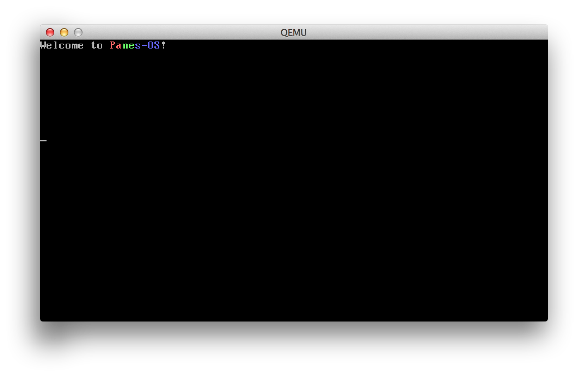

#Panes-OS

Panes-OS is a hobby operating system with currently undefined scope, features, and design decisions.

Currently, the only decision that I've made is that the OS will be written in C.

##Why?
In July, I'll be starting at Microsoft as an SDET on Windows Core - writing an OS in C seemed like an ideal way to prepare for the role.

##The Name?
Panes is an allusion to the OS I'm preparing myself to work on.

##Inspirations
As this is a learning project, I'm taking heavy inspiration from a variety of sources.

* [OSDev Wiki](wiki.osdev.org/)
* [toaruos](https://github.com/klange/toaruos)
* [Modern Operating Systems by Tanenbaum](http://www.mypearsonstore.com/bookstore/modern-operating-systems-9780136006633?xid=PSED)